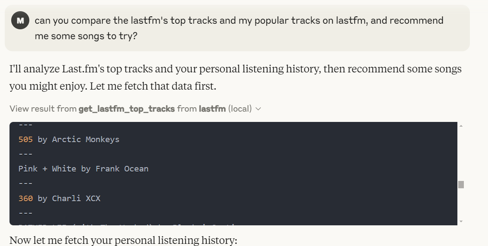

# Last.fm MCP 

Mostly just made this to test out MCPs

# Methods
* `get_users_weeks_top_tracks` - get a user's week top tracks - you have to tell claude the username to pass
* `get_lastfm_top_tracks` - get global last fm tracks.

# Usage with Claude Desktop


Add the following to your claude_desktop_config.json:
## NPX
```
{
  "globalShortcut": "",
  "mcpServers": {
    "lastfm": {
            "command": "uv",
            "args": [
                "--directory",
                "DIR/TO/REPO/HERE",
                "run",
                "last-fm.py"
            ],
            "env": {
        "LASTFM_API_KEY": "APIKEYHERE"}
        }

  }
}
```
# Example
